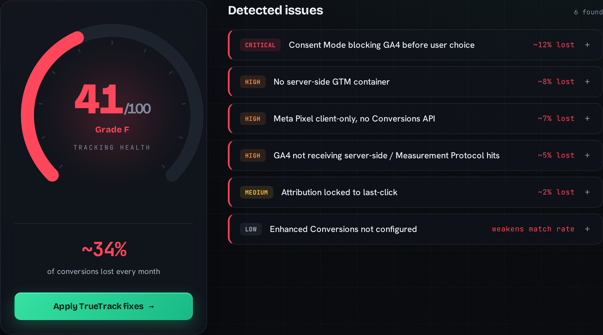
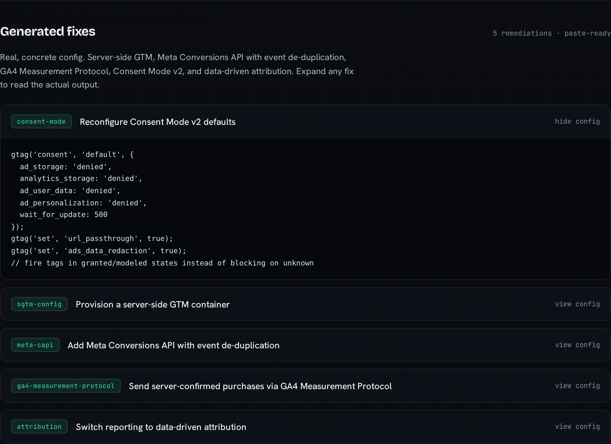
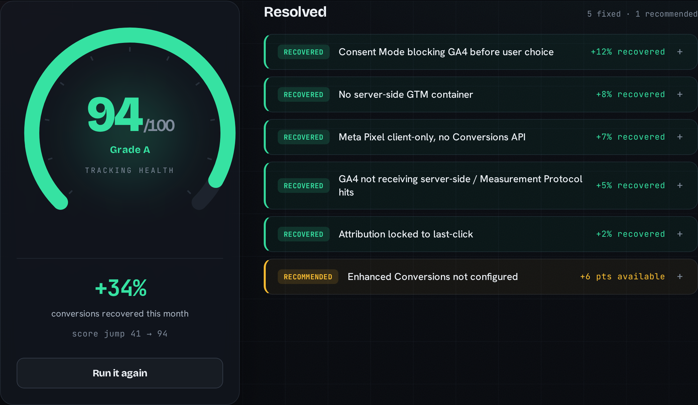

# TrueTrack

<p align="center">
  
</p>

<p align="center"><strong>Your analytics is losing 20-40% of your conversions. TrueTrack finds them and fixes the tracking automatically.</strong></p>

<p align="center">
  <a href="https://truetrack.pages.dev"><strong>Live demo</strong></a>
  &nbsp;·&nbsp; <a href="#the-loop">How it works</a>
  &nbsp;·&nbsp; <a href="#quickstart">Quickstart</a>
  &nbsp;·&nbsp; <a href="#agent-skill--mcp-server">Skill + MCP</a>
</p>


## The problem

Every business running ads is optimizing on a lie. Between consent-mode misconfiguration, browser privacy (ITP and cookie loss), and missing server-side tracking, the average site silently loses 20 to 40% of its conversion data. Teams then bid, budget, and report on numbers that are simply wrong. The usual remedy is a multi-week measurement consulting engagement. TrueTrack does it in minutes.

## The loop

TrueTrack is an autonomous agent that runs one tight loop: **scan, score, fix, prove.** It is model-portable and stack-agnostic, so it works on any GA4, GTM, or Meta setup, and it ships as an open Agent Skill (`SKILL.md`) plus an MCP server so it drops into any agentic workflow.

### 1. Scan and score

It detects the full measurement stack (GTM, GA4, Meta Pixel, consent mode, server-side endpoints) and returns a 0 to 100 Tracking Health Score with a prioritized list of exactly what is broken and what it is costing. On the built-in broken DTC store, that is 41/100, grade F, with an estimated 34% of conversions lost every month.



### 2. Generate the fixes

For each issue it generates concrete, paste-ready remediation: Consent Mode v2 defaults, a server-side GTM container, Meta Conversions API with event de-duplication, GA4 Measurement Protocol payloads, and data-driven attribution. No guesswork, no three-week engagement.



### 3. Prove the recovery

Re-scanning with the fixes applied jumps the score from 41 to 94 (grade A) and surfaces the conversions recovered, with a live counter. Five issues resolve and one is held back as a recommended next step worth six more points.



## Quickstart

```bash
npm install
npm run demo       # scan -> score -> fix -> re-score loop on built-in fixtures
npm test           # vitest: scanner, scoring, fixer
npm run typecheck  # tsc, no emit
npm run mcp        # start the MCP server on stdio
```

`npm run demo` prints the score jump on the built-in demo store:

```
Broken store: score 41/100 (grade F)
  ... prioritized issues with estimated conversions lost ...
Generated 5 fixes:
  - Reconfigure Consent Mode v2 defaults (consent-mode)
  - Provision a server-side GTM container (sgtm-config)
  - Add Meta Conversions API with event de-duplication (meta-capi)
  - Send server-confirmed purchases via GA4 Measurement Protocol (ga4-measurement-protocol)
  - Switch reporting to data-driven attribution (attribution)
After TrueTrack fixes: score 94/100 (grade A)
Score jump: 41 -> 94
Conversions recovered this month: +34%
```

## Architecture

```
src/
  types.ts        shared StackSnapshot / Issue / ScoreResult contracts
  scanner/        stack detection (fixtures now; live page probe is next)
  scoring/        weighted checks -> 0-100 score + prioritized issues
  fixer/          issue -> remediation (sGTM, GA4 MP, Meta CAPI) + apply loop
  mcp/
    server.ts     the four tool handlers
    stdio.ts      MCP server bound to a stdio transport
  demo.ts         end-to-end CLI proof of the score-jump loop
fixtures/
  broken-store/   deliberately broken tag setup (scores 41)
  fixed-store/    the corrected twin (scores 94)
web/              Vite + React scorecard UI (animated gauge, recovered counter)
tests/            vitest specs pinned to the demo contract
```

`scanner` produces a `StackSnapshot`, `scoring` turns it into a `ScoreResult`, and `fixer` maps the issues to remediation and can `applyFixes` to return a corrected snapshot for the re-scan. The same functions back the CLI demo, the MCP tools, and the web UI, so the score-jump narrative is identical everywhere.

The web app is fully self-contained: it vendors a frozen copy of the scoring engine under `web/src/engine`, so the build has no dependency on the monorepo layout. The deployed demo runs on the built-in fixtures, so it never fails when clicked.

## Scoring

The score starts at 100. Each check models a known conversion-loss failure mode and removes weighted points when it fails. Issues are returned sorted by impact with an estimated share of conversions lost.

| Check | Severity | Weight | Est. conversions lost |
|---|---|---|---|
| Consent Mode blocking GA4 before user choice | critical | 20 | ~12% |
| No server-side GTM container | high | 15 | ~8% |
| Meta Pixel client-only, no Conversions API | high | 10 | ~7% |
| GA4 not receiving server-side / Measurement Protocol hits | high | 5 | ~5% |
| Attribution locked to last-click | medium | 3 | ~2% |
| Enhanced Conversions not configured | low | 6 | recommended |

The broken fixture fails all six and scores 41 (F). Applying the five generated fixes leaves only Enhanced Conversions, which scores 94 (A). Grades: A is 90+, B is 80+, C is 70+, D is 50+, otherwise F. Weights are calibrated against real client benchmarks.

## Agent Skill + MCP server

- `SKILL.md` defines the agent skill: when to use it and the scan, score, fix, prove workflow.
- `src/mcp/stdio.ts` runs the MCP server over stdio and exposes four tools: `scan_site`, `score_site`, `generate_fixes`, and `apply_fixes`. Start it with `npm run mcp`.

To wire it into an MCP client (for example Claude Desktop), add this to your client config and point `cwd` at your local clone:

```json
{
  "mcpServers": {
    "truetrack": {
      "command": "npx",
      "args": ["-y", "tsx", "src/mcp/stdio.ts"],
      "cwd": "/absolute/path/to/truetrack"
    }
  }
}
```

## Tech stack

TypeScript, Vite + React (scorecard UI), Cloudflare Pages (hosting), GA4 Measurement Protocol, server-side Google Tag Manager, Meta Conversions API, the Model Context Protocol (`@modelcontextprotocol/sdk`, stdio transport), Claude or Kimi (remediation reasoning), and GitHub Actions (CI and tests). A hosted scan/fix API on Cloudflare Workers is planned.

## Status

- [x] Typed contracts, fixtures, weighted scoring, green CI
- [x] Fix generation and the apply / re-score loop (41 to 94)
- [x] Web scorecard UI (Vite + React, animated gauge, recovered counter), deployed live
- [x] MCP server bound to stdio (`scan_site`, `score_site`, `generate_fixes`, `apply_fixes`)
- [ ] Live page scanner (replace fixtures with a real page probe)
- [ ] Hosted MCP transport on Cloudflare Workers

## Demo

Live: [https://truetrack.pages.dev](https://truetrack.pages.dev). The demo runs on built-in fixtures, so it never fails live.

## Team

Vinay Sawant (lead) and Ketaki Shinde. Built for the UCWS Singapore Hackathon 2026.

## License

MIT. See [LICENSE](./LICENSE).
